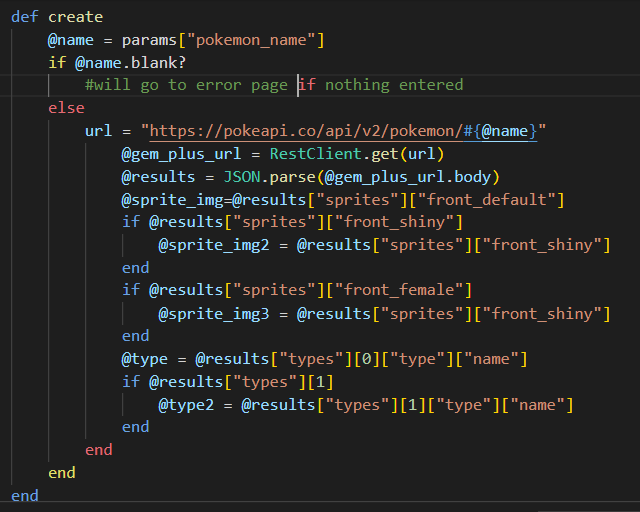
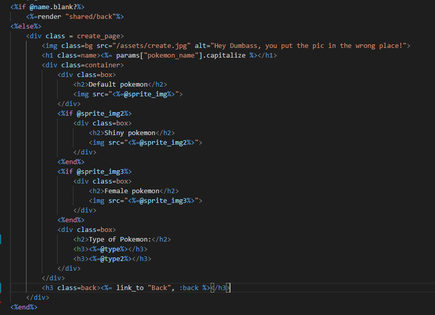
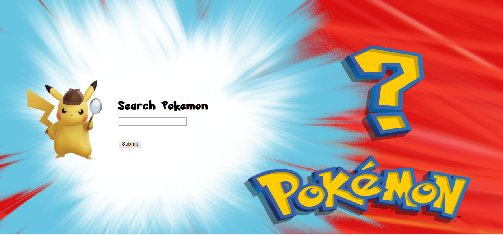
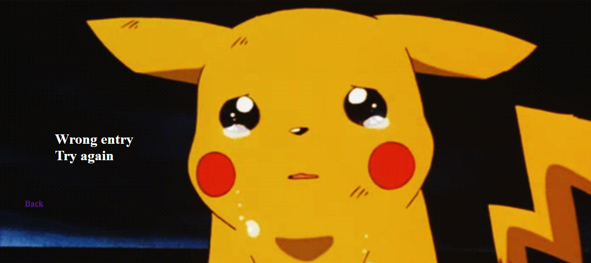
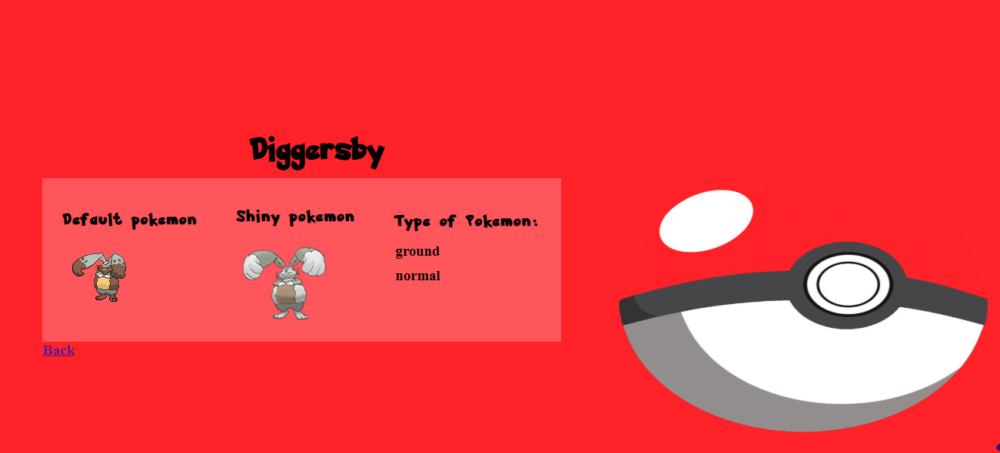

# JoPokedex

## Create Controller

This page is all the logic, it grabs the pokeapi and uses the params entered from the user to get the information on the pokemon they wanted

## Create HTML
____

This is the html for the viewing of Jo's pokedex

## Initial_page
___

This picture shows the landing page of Jo's pokedex

## No entry page
___

This pictuer is showing what happens when you enter nothing or enter a typo into the search, it sends you here to tell you something went wrong.

## Response page
___

This is what you see when you enter in a valid pokemon name, it displays the pokemon with a picture and it's type.